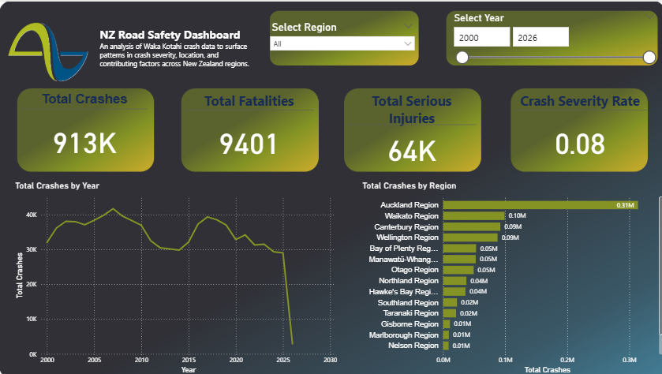
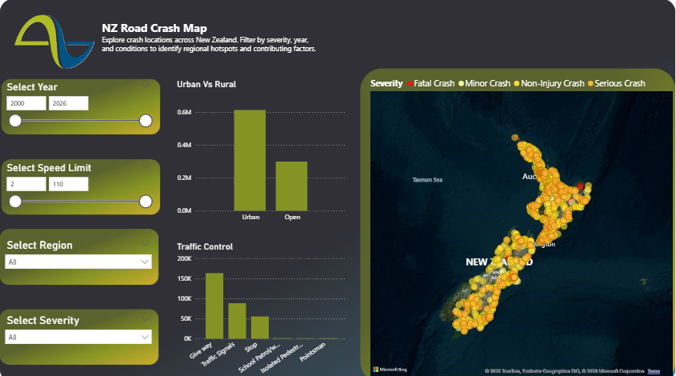
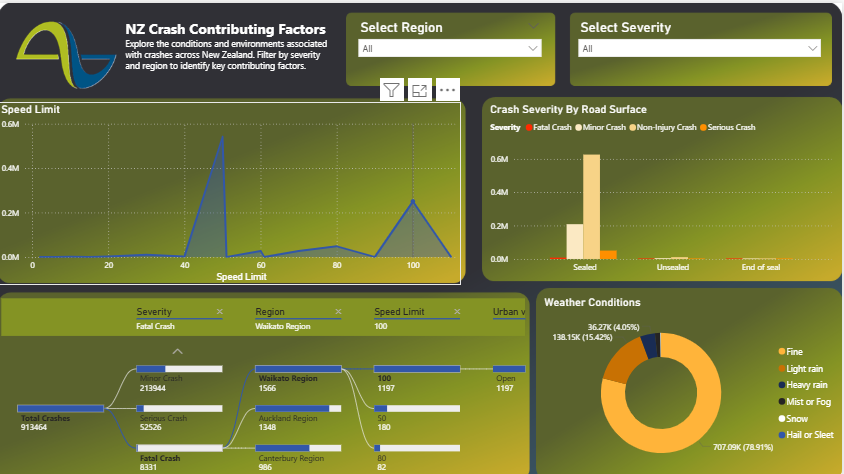
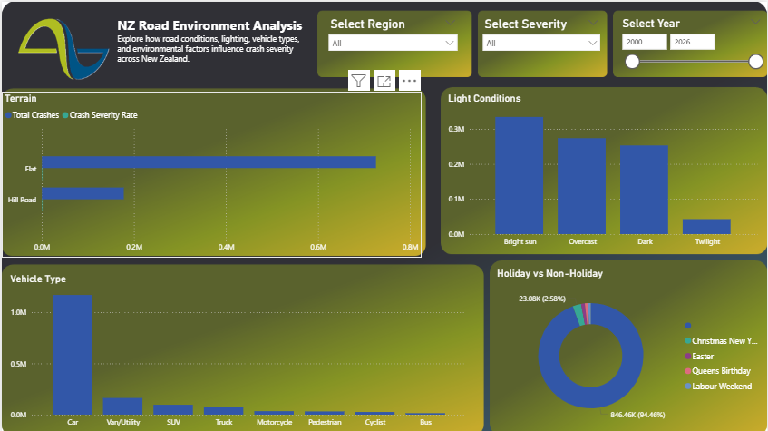

# NZ Road Crash Analysis - PowerBI Dashboard

## Overview 
A PowerBI dashboard analysisng 20 years of NZ crash data using Waka Kotahi Crash Analysis System (CAS) dataset. Buult to identify crash hotspots, contributing factors, and severity patterns across NZ regions.

## Dashboard Preview

## Dashboard Pages
- **Executive Summary** : KPIs, crash trends by year and region
- **Crash Map** : Geographic hotspot analysis with severity overlay
- **Contributing Factors** : Weather, road surface, speed limit analysis
- **Road Environment** : Light coniditions, vehicle types, terrain analysis

## Tools and Skills 
- PowerBI
- Power Query (data cleaning and transformation)
- DAX (calculated measures)
- Data modelling
- Waka Kotahi CAS dataset (NZTM2000 coordinate conversion)

## Data Source
[Waka Kotahi Crash Analysis System]([https://www.nzta.govt.nz/safety/safety-resources/road-safety-information-and-tools/crash-analysis-system/)](https://opendata-nzta.opendata.arcgis.com/search?tags=crashes)
